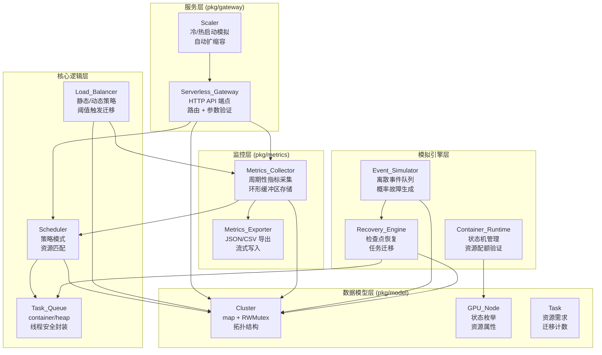
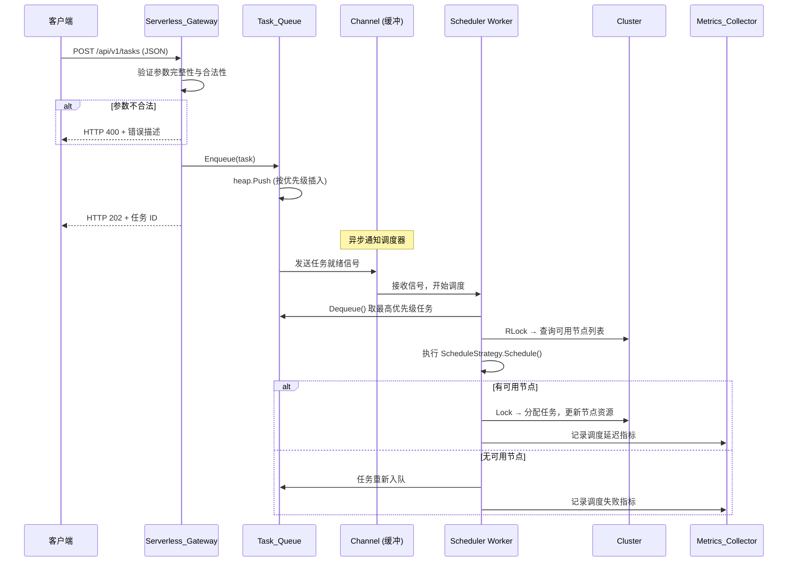
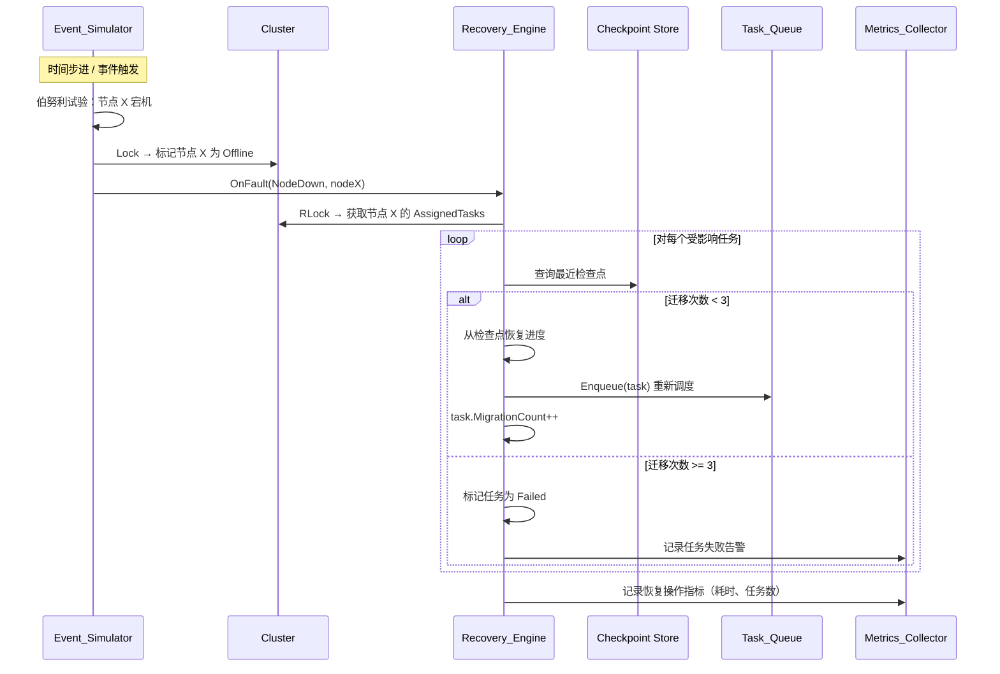

# 技术设计文档 — Schedulix

## 概述

Schedulix 是一个面向学习者的 Go 语言 Serverless GPU 集群调度模拟器。项目采用渐进式学习路径设计，从 Go 基础语法逐步过渡到万卡规模分布式调度系统。所有 GPU 节点均为软件模拟，无需真实硬件。

### 设计目标

- 提供清晰的模块化架构，每个学习阶段对应独立的 Go 包
- 通过接口（interface）抽象实现策略可插拔（调度算法、负载均衡策略）
- 利用 Go 并发原语（goroutine、channel、sync 包）实现并行调度
- 支持万卡（10,000 节点）规模的集群模拟，单次调度延迟 < 100ms
- 提供事件驱动的故障模拟与容灾恢复机制
- 封装核心功能为 Serverless HTTP API
- 输出结构化监控数据（JSON/CSV），便于学习者分析

### 技术选型

| 类别 | 选型 | 理由 |
|------|------|------|
| 语言 | Go 1.21+ | 项目核心语言，原生并发支持 |
| 优先级队列 | `container/heap` | Go 标准库，学习堆数据结构 |
| HTTP 框架 | `net/http` (标准库) | 减少外部依赖，适合学习 |
| JSON 处理 | `encoding/json` | Go 标准库 |
| CSV 输出 | `encoding/csv` | Go 标准库 |
| 测试框架 | `testing` (标准库) | Go 原生测试 |
| 属性测试 | `pgregory.net/rapid` | 现代 Go 属性测试库，API 简洁，支持自动缩小反例 |
| 断言库 | `github.com/stretchr/testify` | 丰富的断言方法，社区标准 |

## 架构

### 整体架构概述

项目采用**分层事件驱动架构**，自底向上分为五层：数据模型层、核心逻辑层、模拟引擎层、服务层和监控层。各层通过 Go 接口解耦，支持独立编译和测试。

**核心架构决策：**

1. **分层而非微服务**：作为学习项目，单进程分层架构降低了部署复杂度，同时通过接口隔离保持了模块独立性。每一层只依赖其下层的接口，不允许跨层直接调用。
2. **事件驱动而非轮询**：模拟引擎采用离散事件模拟（Discrete Event Simulation）模式，通过事件队列驱动时间推进，而非固定时间步长轮询。这样在事件稀疏时效率更高，且更贴近真实调度系统的工作方式。
3. **接口优先设计**：所有跨层交互通过 Go interface 定义契约。这使得学习者可以先理解接口语义，再逐步实现具体逻辑，也便于在不同学习阶段替换实现。

### 架构分层详解

#### 第一层：数据模型层（`pkg/model`）

**职责**：定义系统中所有核心实体的数据结构和基本操作。这一层是纯数据层，不包含业务逻辑，不依赖任何其他层。

**设计决策**：
- **枚举用 `int` + `iota` 而非字符串**：Go 惯用模式，编译期类型安全，比较操作为 O(1)。通过自定义 `MarshalJSON`/`UnmarshalJSON` 方法支持 JSON 字符串序列化，兼顾性能与可读性。
- **Cluster 用 `map[string]*GPU_Node`（指针映射）**：万卡规模下，节点查找必须是 O(1)。使用指针避免大结构体拷贝，修改节点状态时无需重新插入 map。
- **拓扑结构嵌套在 Cluster 中**：三层嵌套（DataCenter → Cabinet → Rack）模拟真实物理部署。拓扑信息用于拓扑感知调度（优先将关联任务调度到同一机架/机柜，减少模拟网络延迟）。
- **Task 内置 `MigrationCount` 字段**：直接支持需求 6.5 的"三次迁移失败"检测，避免在 Recovery_Engine 中维护额外的外部计数器。
- **`ResourceRequirement` 独立为结构体**：将资源需求从 Task 中抽离，便于未来扩展（如增加 GPU 显存、网络带宽等维度），也使得资源匹配逻辑可以独立测试。

#### 第二层：核心逻辑层（`pkg/queue`, `pkg/scheduler`）

**职责**：实现任务排队、调度算法选择和资源分配的核心业务逻辑。

**设计决策**：
- **优先级队列基于 `container/heap` 封装**：直接实现 `heap.Interface` 的五个方法（`Len`, `Less`, `Swap`, `Push`, `Pop`），外层封装线程安全的 `TaskQueue` 结构体。选择标准库而非第三方库，是因为学习者需要理解堆的工作原理。
- **线程安全策略**：`TaskQueue` 内部使用 `sync.Mutex` 保护堆操作（而非 `RWMutex`），因为堆的读操作（Peek）和写操作（Push/Pop）都会修改内部索引，读写锁在此场景无优势。
- **调度策略通过 `ScheduleStrategy` 接口抽象**：每种算法（First-Fit、Best-Fit、Round-Robin）实现同一接口，调度器持有接口引用，运行时可切换策略。这是经典的策略模式（Strategy Pattern），也是 Go 接口教学的核心示例。
- **调度器与队列分离**：调度器不直接管理队列，而是从队列获取任务、向集群分配资源。这种分离使得队列策略（优先级排序规则）和调度策略（节点选择规则）可以独立变化。

**First-Fit vs Best-Fit vs Round-Robin 的权衡**：

| 算法 | 时间复杂度 | 资源利用率 | 碎片化 | 适用场景 |
|------|-----------|-----------|--------|---------|
| First-Fit | O(n) 最坏 | 中等 | 较高 | 快速调度，对延迟敏感 |
| Best-Fit | O(n) | 较高 | 较低 | 资源紧张，需要最大化利用率 |
| Round-Robin | O(1) 均摊 | 均匀 | 中等 | 负载均衡，公平性优先 |

#### 第三层：模拟引擎层（`pkg/simulator`, `pkg/recovery`, `pkg/container`）

**职责**：驱动模拟时间推进、生成故障事件、执行容灾恢复、管理容器生命周期。

**设计决策**：
- **离散事件模拟（DES）而非固定时间步长**：事件模拟器维护一个按时间排序的事件优先级队列。每次从队列中取出最早的事件处理，处理过程中可能产生新事件插入队列。这种方式在事件稀疏时跳过空闲时段，万卡规模下比逐步轮询高效得多。但为了兼顾学习者理解，也保留简单的时间步进模式作为入门选项。
- **故障概率模型**：每个时间步中，对每个节点独立进行伯努利试验（Bernoulli trial），根据配置的概率决定是否触发故障。各故障类型（宕机、网络延迟、性能降级、恢复）的概率独立配置，互不影响。
- **检查点机制采用内存快照**：`Checkpoint` 记录任务 ID、执行进度、时间戳和所在节点。恢复时从最近检查点的进度继续，而非从头开始。检查点存储在内存中（`map[string]*Checkpoint`），因为这是模拟器，不需要持久化到磁盘。
- **容器状态机**：容器生命周期是严格的状态机（Created → Running → Stopped → Destroyed），非法状态转换会返回错误。状态变更通过观察者模式（`ContainerLifecycle` 接口）通知订阅者，实现松耦合。

**事件处理流程**：

```
事件队列 (按时间排序)
    │
    ▼
取出最早事件 ──→ 判断事件类型
    │                │
    │    ┌───────────┼───────────┐───────────┐
    │    ▼           ▼           ▼           ▼
    │  节点宕机    网络延迟    性能降级    节点恢复
    │    │           │           │           │
    │    ▼           ▼           ▼           ▼
    │  标记节点     更新延迟    降低算力    恢复状态
    │  为 Offline   参数       系数        为 Idle
    │    │                                  │
    │    ▼                                  │
    │  触发容灾 ──→ Recovery_Engine          │
    │    │           │                      │
    │    │           ▼                      │
    │    │     检测受影响任务                │
    │    │           │                      │
    │    │           ▼                      │
    │    │     从检查点恢复                  │
    │    │     重新入队调度                  │
    │    │                                  │
    ▼    ▼                                  ▼
  记录事件日志 ◄────────────────────────────┘
    │
    ▼
  更新监控指标
    │
    ▼
  继续处理下一个事件
```

#### 第四层：服务层（`pkg/gateway`）

**职责**：将核心功能暴露为 HTTP API，处理请求路由、参数验证、冷/热启动模拟和自动扩缩容。

**设计决策**：
- **使用标准库 `net/http` 而非 Gin/Echo 等框架**：减少外部依赖，让学习者理解 HTTP 处理的底层机制。`http.ServeMux` 足以满足路由需求。
- **无状态函数设计**：每个 API handler 不持有请求间状态，所有状态通过依赖注入的 Cluster、Scheduler 等组件访问。这模拟了真实 Serverless 函数的无状态特性。
- **冷启动模拟**：通过 `time.Sleep` 模拟函数首次调用的初始化延迟（可配置），热启动则跳过延迟。使用 `sync.Once` 或时间戳判断是否为冷启动。
- **自动扩缩容逻辑**：维护一个函数实例计数器，根据并发请求数动态调整。当无请求时，通过定时器（`time.AfterFunc`）延迟缩容到零，避免频繁抖动。

**API 端点设计**：

| 方法 | 路径 | 功能 | 请求体 | 响应 |
|------|------|------|--------|------|
| POST | `/api/v1/tasks` | 提交任务 | `Task` JSON | 任务 ID + 状态 |
| GET | `/api/v1/tasks/{id}` | 查询任务状态 | - | `Task` JSON |
| GET | `/api/v1/cluster/status` | 查询集群状态 | - | `ClusterMetrics` JSON |
| GET | `/api/v1/cluster/nodes` | 查询节点列表 | - | `[]GPU_Node` JSON |
| POST | `/api/v1/cluster/snapshot` | 创建集群快照 | - | `Cluster` JSON |
| PUT | `/api/v1/cluster/snapshot` | 从快照恢复 | `Cluster` JSON | 恢复状态 |
| POST | `/api/v1/simulator/start` | 启动事件模拟 | `EventConfig` JSON | 模拟状态 |
| GET | `/api/v1/metrics` | 获取监控指标 | - | `ClusterMetrics` JSON |
| GET | `/api/v1/metrics/export` | 导出历史指标 | `?format=json\|csv` | 文件下载 |

#### 第五层：监控层（`pkg/metrics`）

**职责**：周期性采集集群和节点级指标，提供 JSON/CSV 导出。

**设计决策**：
- **采集与存储分离**：`Collector` 负责定时采集快照，`Exporter` 负责格式化输出。采集频率可配置（默认每秒一次）。
- **环形缓冲区存储历史数据**：使用固定大小的环形缓冲区（`ring buffer`）存储最近 N 个指标快照，避免内存无限增长。缓冲区满时覆盖最旧数据。
- **指标快照包含版本号**：每次采集递增版本号，便于检测数据一致性和排序。
- **CSV 导出采用流式写入**：使用 `encoding/csv` 的 `Writer` 逐行写入，避免将全部历史数据加载到内存。


### 架构图



### 并发模型详解

Schedulix 的并发设计是学习 Go 并发编程的核心部分。以下是各组件的并发策略：

**生产者-消费者模式（任务调度）**：

```
                    ┌─────────────┐
  HTTP Handler ──→  │  buffered   │  ──→ Scheduler goroutine
  HTTP Handler ──→  │  channel    │  ──→ Scheduler goroutine
  HTTP Handler ──→  │  (任务通道)  │  ──→ Scheduler goroutine
                    └─────────────┘
                     容量 = 1000
```

- 多个 HTTP handler goroutine 作为生产者，将任务发送到 buffered channel
- 多个 Scheduler worker goroutine 作为消费者，从 channel 接收任务并执行调度
- Channel 容量设为 1000，在突发流量时提供缓冲，避免生产者阻塞
- 使用 `context.Context` 传播取消信号和超时控制

**读写锁保护共享状态**：

```
Cluster.mu (sync.RWMutex)
├── 读锁 (RLock)：查询节点状态、计算负载指标、导出快照
└── 写锁 (Lock)：分配任务到节点、更新节点状态、故障/恢复事件处理
```

- Cluster 使用 `sync.RWMutex` 而非 `sync.Mutex`，因为读操作（查询、监控采集）远多于写操作（调度、故障处理），读写锁允许多个读操作并发执行
- TaskQueue 使用 `sync.Mutex`，因为堆操作即使是 Peek 也可能涉及内部状态，读写锁无优势

**WaitGroup 协调批量操作**：

```go
// 并发调度多个任务，等待全部完成后汇总结果
var wg sync.WaitGroup
results := make(chan ScheduleResult, len(tasks))
for _, task := range tasks {
    wg.Add(1)
    go func(t *Task) {
        defer wg.Done()
        result := scheduler.Schedule(t, cluster)
        results <- result
    }(task)
}
wg.Wait()
close(results)
```

### 万卡规模性能设计

支持 10,000 节点的关键性能优化策略：

1. **节点索引**：`map[string]*GPU_Node` 提供 O(1) 节点查找。额外维护按状态分组的索引（`map[NodeStatus][]*GPU_Node`），调度时只遍历 Idle 节点，避免扫描全部 10,000 个节点。

2. **预计算可用资源**：每次资源变更时增量更新可用资源汇总，而非每次调度时全量计算。

3. **分片锁（可选优化）**：当单一 RWMutex 成为瓶颈时，可按机架（Rack）分片加锁，不同机架的调度操作互不阻塞。这是阶段五的进阶优化。

4. **对象池（`sync.Pool`）**：高频创建的临时对象（如调度结果、指标快照）使用对象池复用，减少 GC 压力。

5. **批量调度**：将多个待调度任务打包为一批，一次性获取写锁完成分配，减少锁竞争次数。

### 学习阶段与模块映射


**阶段依赖关系说明**：每个阶段只依赖前序阶段的接口，不依赖具体实现。例如阶段四（事件模拟）依赖阶段一定义的 `GPU_Node` 和 `Cluster` 接口，但不依赖阶段二的具体调度算法。这确保了每个模块可以独立编译和测试。

## 组件与接口

### 项目目录结构

```
schedulix/
├── cmd/
│   └── server/
│       └── main.go              # Serverless 网关入口，依赖注入组装
├── pkg/
│   ├── model/                   # 阶段一：数据模型层（零外部依赖）
│   │   ├── node.go              # GPU_Node 结构体、状态枚举、JSON 序列化
│   │   ├── task.go              # Task 结构体、ResourceRequirement、状态枚举
│   │   ├── cluster.go           # Cluster 结构体、拓扑结构、并发安全方法
│   │   ├── container.go         # Container 结构体、状态机定义
│   │   └── checkpoint.go        # Checkpoint 结构体
│   ├── queue/                   # 阶段二：任务队列（依赖 model）
│   │   └── priority_queue.go    # heap.Interface 实现 + sync.Mutex 封装
│   ├── scheduler/               # 阶段二/三：调度器（依赖 model, queue）
│   │   ├── strategy.go          # ScheduleStrategy 接口定义
│   │   ├── firstfit.go          # First-Fit：遍历节点，首个满足即分配
│   │   ├── bestfit.go           # Best-Fit：遍历节点，剩余资源最少者分配
│   │   ├── roundrobin.go        # Round-Robin：维护游标，轮询分配
│   │   └── concurrent.go        # 阶段三：channel + goroutine 并发调度
│   ├── simulator/               # 阶段四：事件模拟（依赖 model）
│   │   ├── event.go             # FaultEvent 定义、FaultType 枚举
│   │   ├── engine.go            # 离散事件队列、概率引擎、时间步进
│   │   └── config.go            # EventConfig JSON 解析与验证
│   ├── recovery/                # 阶段四：容灾恢复（依赖 model, queue）
│   │   ├── engine.go            # 故障检测、任务重提交、三次失败标记
│   │   └── checkpoint.go        # 检查点保存与恢复逻辑
│   ├── balancer/                # 阶段五：负载均衡（依赖 model, metrics）
│   │   ├── strategy.go          # BalanceStrategy 接口定义
│   │   ├── static.go            # 基于算力权重的静态分配
│   │   └── dynamic.go           # 基于实时负载的动态分配 + 阈值迁移
│   ├── gateway/                 # 阶段六：Serverless 网关（依赖所有核心包）
│   │   ├── handler.go           # HTTP handler 函数，参数验证
│   │   ├── router.go            # ServeMux 路由注册
│   │   └── scaler.go            # 冷/热启动模拟、实例计数、缩容定时器
│   ├── container/               # 阶段七：容器运行时（依赖 model）
│   │   ├── runtime.go           # 资源配额验证、多容器管理
│   │   └── lifecycle.go         # 状态机转换、观察者通知
│   └── metrics/                 # 阶段八：监控（依赖 model）
│       ├── collector.go         # 定时采集、环形缓冲区、版本号
│       └── exporter.go          # JSON 序列化、CSV 流式写入
├── configs/
│   ├── cluster.json             # 集群拓扑配置示例
│   └── events.json              # 事件模拟配置示例
├── docs/
│   ├── roadmap.md               # 总体学习路线图
│   └── modules/                 # 各阶段 README
│       ├── phase1.md
│       ├── phase2.md
│       └── ...
├── go.mod
└── go.sum
```


### 核心接口定义

#### ScheduleStrategy — 调度策略接口

```go
// ScheduleStrategy 定义调度算法的统一抽象。
// 实现者只需关注"给定一个任务和一个集群，选择哪个节点"这一核心问题。
// 调度器（Scheduler）持有此接口的引用，运行时可通过配置切换策略。
//
// 设计考量：
// - 接口方法接收 *Cluster 而非 []*GPU_Node，因为某些策略（如拓扑感知调度）
//   需要访问集群拓扑信息，而不仅仅是节点列表。
// - 返回 nodeID 而非 *GPU_Node，避免调用方直接修改节点状态，
//   资源更新由 Scheduler 统一执行。
type ScheduleStrategy interface {
    // Schedule 将任务分配到合适的节点，返回目标节点 ID。
    // 如果没有可用节点满足资源需求，返回 ErrNoAvailableNode。
    // 实现必须是无副作用的：不修改 task 或 cluster 状态。
    Schedule(task *model.Task, cluster *model.Cluster) (nodeID string, err error)
    // Name 返回策略名称，用于日志和监控标识。
    Name() string
}
```

#### BalanceStrategy — 负载均衡策略接口

```go
// BalanceStrategy 定义负载均衡策略的统一抽象。
// 与 ScheduleStrategy 的区别：ScheduleStrategy 关注"新任务放哪里"，
// BalanceStrategy 关注"已有任务是否需要重新分布"。
//
// 设计考量：
// - SelectNode 接收节点切片而非 Cluster，因为负载均衡通常在
//   已过滤的候选节点集上操作（如同一机架内的节点）。
// - ShouldRebalance 的 threshold 参数外部传入而非内置，
//   允许运行时动态调整阈值。
type BalanceStrategy interface {
    // SelectNode 根据负载情况选择最优节点。
    // nodes 切片中的节点已经过状态过滤（仅包含 Idle 或 Busy 状态）。
    SelectNode(task *model.Task, nodes []*model.GPU_Node) (nodeID string, err error)
    // ShouldRebalance 判断是否需要触发重平衡。
    // 计算节点间负载的标准差或最大差值，与 threshold 比较。
    // threshold 取值范围 [0.0, 1.0]，0.0 表示任何不均衡都触发，1.0 表示从不触发。
    ShouldRebalance(nodes []*model.GPU_Node, threshold float64) bool
    // Name 返回策略名称。
    Name() string
}
```

#### EventHandler — 事件处理接口

```go
// EventHandler 定义事件处理的回调接口。
// 采用观察者模式：Event_Simulator 在生成事件后，
// 遍历注册的 EventHandler 列表依次调用。
//
// 设计考量：
// - OnFault 和 OnRecovery 分开定义而非统一为 OnEvent，
//   因为故障处理和恢复处理的逻辑差异很大（故障需要迁移任务，
//   恢复需要将节点重新加入可用池），分开定义使实现更清晰。
// - 返回 error 允许处理器报告处理失败，
//   Event_Simulator 可据此决定是否重试或记录告警。
type EventHandler interface {
    // OnFault 处理故障事件。实现者通常需要：
    // 1. 更新节点状态
    // 2. 检测受影响任务
    // 3. 触发任务迁移
    OnFault(event *simulator.FaultEvent) error
    // OnRecovery 处理恢复事件。实现者通常需要：
    // 1. 恢复节点状态为 Idle
    // 2. 将节点重新加入可用节点池
    OnRecovery(event *simulator.FaultEvent) error
}
```

#### ContainerLifecycle — 容器生命周期接口

```go
// ContainerLifecycle 定义容器状态变更的事件订阅接口。
// 采用观察者模式，Container_Runtime 在状态转换时通知所有订阅者。
//
// 设计考量：
// - 回调方法不返回 error，因为状态变更已经发生，
//   订阅者不应阻止状态转换。如果订阅者处理失败，应自行记录日志。
// - 传递 oldState 和 newState 而非仅 newState，
//   便于订阅者判断转换方向（如区分 Running→Stopped 和 Created→Stopped）。
type ContainerLifecycle interface {
    // OnStateChange 容器状态变更回调。
    // 在状态转换完成后同步调用，实现者应避免长时间阻塞。
    OnStateChange(containerID string, oldState, newState ContainerState)
}
```

#### TaskQueue — 线程安全优先级队列接口

```go
// TaskQueue 定义任务队列的操作接口。
// 将队列操作抽象为接口，使得调度器不依赖具体的队列实现。
// 默认实现基于 container/heap + sync.Mutex。
//
// 设计考量：
// - Enqueue/Dequeue 而非 Push/Pop，语义更明确。
// - Dequeue 在队列为空时返回 ErrQueueEmpty，而非阻塞等待。
//   阻塞语义由上层的 channel 机制提供。
type TaskQueue interface {
    // Enqueue 将任务加入队列，按优先级排序。
    // 同优先级的任务按提交时间 FIFO 排序。
    Enqueue(task *model.Task) error
    // Dequeue 取出优先级最高的任务。
    // 队列为空时返回 ErrQueueEmpty。
    Dequeue() (*model.Task, error)
    // Peek 查看优先级最高的任务但不移除。
    // 队列为空时返回 ErrQueueEmpty。
    Peek() (*model.Task, error)
    // Len 返回当前队列长度。
    Len() int
    // IsEmpty 返回队列是否为空。
    IsEmpty() bool
}
```

### 组件交互流程

#### 任务提交与调度流程



#### 故障检测与容灾恢复流程




## 数据模型

### GPU_Node — GPU 计算节点

```go
// NodeStatus 节点状态枚举。
// 使用 int + iota 而非字符串：编译期类型安全，switch 语句可检查穷举，
// 比较操作为 O(1)。通过自定义 MarshalJSON/UnmarshalJSON 支持 JSON 字符串序列化。
type NodeStatus int

const (
    NodeStatusIdle      NodeStatus = iota // 空闲，可接受新任务
    NodeStatusBusy                        // 忙碌，资源已分配但未耗尽
    NodeStatusOffline                     // 离线/宕机，不可调度
    NodeStatusDegraded                    // 性能降级，算力折扣运行
)

// GPU_Node 模拟的 GPU 计算节点。
//
// 设计考量：
// - ComputePower 和 MemoryTotal 为静态属性（节点创建后不变），
//   MemoryUsed 为动态属性（随任务分配变化）。
// - FaultRate 用于事件模拟器的伯努利试验，取值 [0.0, 1.0]。
// - RackID/CabinetID/DataCenterID 用于拓扑感知调度，
//   冗余存储（Cluster 拓扑中也有）是为了避免反向查找的 O(n) 开销。
type GPU_Node struct {
    ID            string     `json:"id"`
    Status        NodeStatus `json:"status"`
    ComputePower  int        `json:"compute_power"`   // 算力（TFLOPS）
    MemoryTotal   int        `json:"memory_total"`    // 总内存（MB）
    MemoryUsed    int        `json:"memory_used"`     // 已用内存（MB）
    FaultRate     float64    `json:"fault_rate"`       // 故障率 [0.0, 1.0]
    AssignedTasks []string   `json:"assigned_tasks"`   // 已分配任务 ID 列表
    FaultCount    int        `json:"fault_count"`      // 累计故障次数
    UptimeMs      int64      `json:"uptime_ms"`        // 累计运行时间（毫秒）
    RackID        string     `json:"rack_id"`          // 所属机架 ID
    CabinetID     string     `json:"cabinet_id"`       // 所属机柜 ID
    DataCenterID  string     `json:"data_center_id"`   // 所属数据中心 ID
}

// AvailableMemory 返回节点剩余可用内存。
// 这是一个派生值，不单独存储，避免状态不一致。
func (n *GPU_Node) AvailableMemory() int {
    return n.MemoryTotal - n.MemoryUsed
}

// CanAccept 判断节点是否能接受指定资源需求的任务。
// 同时检查状态和资源两个维度。
func (n *GPU_Node) CanAccept(req ResourceRequirement) bool {
    if n.Status == NodeStatusOffline {
        return false
    }
    effectivePower := n.ComputePower
    if n.Status == NodeStatusDegraded {
        effectivePower = effectivePower / 2 // 降级时算力减半
    }
    return effectivePower >= req.ComputePower && n.AvailableMemory() >= req.Memory
}
```

### Task — 计算任务

```go
// TaskStatus 任务状态。
// 状态转换规则：
//   Pending → Running（被调度到节点）
//   Running → Completed（正常完成）
//   Running → Migrating（节点故障，迁移中）
//   Migrating → Pending（迁移后重新入队）
//   Migrating → Failed（三次迁移失败）
//   Pending → Failed（超时未调度）
type TaskStatus int

const (
    TaskStatusPending   TaskStatus = iota // 等待调度
    TaskStatusRunning                     // 执行中
    TaskStatusCompleted                   // 已完成
    TaskStatusFailed                      // 失败（不可恢复）
    TaskStatusMigrating                   // 迁移中
)

// ResourceRequirement 资源需求。
// 独立结构体便于扩展（未来可增加 GPU 显存、网络带宽等维度）
// 和独立测试（资源匹配逻辑可单独验证）。
type ResourceRequirement struct {
    ComputePower int `json:"compute_power"` // 所需算力（TFLOPS）
    Memory       int `json:"memory"`        // 所需内存（MB）
}

// Task 用户提交的计算任务。
type Task struct {
    ID              string              `json:"id"`
    Resource        ResourceRequirement `json:"resource"`
    Priority        int                 `json:"priority"`         // 数值越大优先级越高
    EstimatedTimeMs int64               `json:"estimated_time_ms"` // 预计执行时间（毫秒）
    SubmitTime      time.Time           `json:"submit_time"`
    Status          TaskStatus          `json:"status"`
    AssignedNodeID  string              `json:"assigned_node_id,omitempty"`
    MigrationCount  int                 `json:"migration_count"`  // 迁移次数，>=3 时标记失败
    Progress        float64             `json:"progress"`         // 执行进度 [0.0, 1.0]
}
```

### Cluster — 集群拓扑

```go
// Cluster 模拟集群。
//
// 并发安全策略：
// - mu (sync.RWMutex) 保护 Nodes map 和 DataCenters 的并发访问。
// - 读操作（查询节点、计算指标）使用 RLock，允许并发读。
// - 写操作（分配任务、更新状态）使用 Lock，独占访问。
// - mu 不参与 JSON 序列化（无 json tag），快照/恢复时需要外部同步。
//
// 索引策略：
// - Nodes: map[string]*GPU_Node — 主索引，O(1) 按 ID 查找
// - statusIndex: map[NodeStatus][]string — 辅助索引，按状态快速过滤
//   每次状态变更时同步更新，避免调度时全量扫描
type Cluster struct {
    Nodes       map[string]*GPU_Node `json:"nodes"`
    DataCenters []DataCenter         `json:"data_centers"`
    statusIndex map[NodeStatus][]string // 按状态分组的节点 ID 索引（不序列化）
    mu          sync.RWMutex            // 并发保护（不序列化）
}

// DataCenter 数据中心 — 拓扑最顶层
type DataCenter struct {
    ID       string    `json:"id"`
    Cabinets []Cabinet `json:"cabinets"`
}

// Cabinet 机柜 — 拓扑中间层
type Cabinet struct {
    ID    string `json:"id"`
    Racks []Rack `json:"racks"`
}

// Rack 机架 — 拓扑最底层，直接包含节点引用
type Rack struct {
    ID      string   `json:"id"`
    NodeIDs []string `json:"node_ids"`
}

// GetAvailableNodes 返回指定状态的节点列表。
// 使用辅助索引，时间复杂度 O(k)，k 为该状态的节点数。
func (c *Cluster) GetAvailableNodes(status NodeStatus) []*GPU_Node { ... }

// UpdateNodeStatus 更新节点状态并同步更新辅助索引。
func (c *Cluster) UpdateNodeStatus(nodeID string, newStatus NodeStatus) error { ... }
```

### FaultEvent — 故障事件

```go
// FaultType 故障类型枚举。
type FaultType int

const (
    FaultNodeDown     FaultType = iota // 节点宕机：状态变为 Offline，所有任务需迁移
    FaultNetworkDelay                  // 网络延迟：模拟调度延迟增大
    FaultDegraded                      // 性能降级：算力折扣（如减半）
    FaultRecovery                      // 节点恢复：状态恢复为 Idle
)

// FaultEvent 模拟故障事件。
// 事件是不可变的：一旦创建不应修改，这简化了并发处理。
type FaultEvent struct {
    ID        string    `json:"id"`
    Type      FaultType `json:"type"`
    NodeID    string    `json:"node_id"`
    Timestamp time.Time `json:"timestamp"`
    Detail    string    `json:"detail,omitempty"`
}
```

### EventConfig — 事件模拟配置

```go
// EventConfig 事件模拟配置（JSON 可序列化）。
// 所有概率值取值范围 [0.0, 1.0]，在反序列化时验证。
// 概率之和不要求为 1.0，因为各事件类型独立判定。
type EventConfig struct {
    NodeDownProb     float64 `json:"node_down_prob"`     // 每步每节点宕机概率
    NetworkDelayProb float64 `json:"network_delay_prob"` // 每步每节点网络延迟概率
    DegradedProb     float64 `json:"degraded_prob"`      // 每步每节点性能降级概率
    RecoveryProb     float64 `json:"recovery_prob"`      // 每步每离线节点恢复概率
    TotalSteps       int     `json:"total_steps"`        // 模拟总步数
    StepIntervalMs   int64   `json:"step_interval_ms"`   // 每步间隔（毫秒）
}
```

### Container — 容器模型

```go
// ContainerState 容器状态。
// 合法状态转换：Created→Running, Running→Stopped, Stopped→Destroyed
// 非法转换（如 Created→Destroyed）返回 ErrInvalidStateTransition。
type ContainerState int

const (
    ContainerCreated   ContainerState = iota
    ContainerRunning
    ContainerStopped
    ContainerDestroyed
)

// Container 模拟容器。
type Container struct {
    ID          string         `json:"id"`
    State       ContainerState `json:"state"`
    HostNodeID  string         `json:"host_node_id"`
    CPUShares   int            `json:"cpu_shares"`
    MemoryLimit int            `json:"memory_limit"`  // MB
    TaskID      string         `json:"task_id,omitempty"`
}
```

### Checkpoint — 检查点

```go
// Checkpoint 任务执行检查点。
// 存储在内存 map[string]*Checkpoint 中（key 为 TaskID）。
// 每次保存覆盖前一个检查点（每个任务只保留最新一个）。
type Checkpoint struct {
    TaskID    string    `json:"task_id"`
    Progress  float64   `json:"progress"`   // 保存时的执行进度 [0.0, 1.0]
    Timestamp time.Time `json:"timestamp"`
    NodeID    string    `json:"node_id"`    // 保存时所在节点
}
```

### MetricsSnapshot — 指标快照

```go
// ClusterMetrics 集群级指标快照。
// 每次采集生成一个不可变快照，存入环形缓冲区。
type ClusterMetrics struct {
    Timestamp           time.Time `json:"timestamp"`
    Version             int       `json:"version"`              // 递增版本号
    TotalTasks          int       `json:"total_tasks"`
    CompletedTasks      int       `json:"completed_tasks"`
    FailedTasks         int       `json:"failed_tasks"`
    AvgScheduleDelayMs  float64   `json:"avg_schedule_delay_ms"`
    ResourceUtilization float64   `json:"resource_utilization"` // [0.0, 1.0]
}

// NodeMetrics 节点级指标快照。
type NodeMetrics struct {
    Timestamp     time.Time `json:"timestamp"`
    NodeID        string    `json:"node_id"`
    CurrentLoad   float64   `json:"current_load"`    // [0.0, 1.0]
    AssignedTasks int       `json:"assigned_tasks"`
    FaultCount    int       `json:"fault_count"`
    UptimeMs      int64     `json:"uptime_ms"`
}
```

### 关键设计决策汇总

| 决策 | 选择 | 备选方案 | 选择理由 |
|------|------|---------|---------|
| 节点状态表示 | `int` + `iota` | 字符串常量 | 类型安全，O(1) 比较，switch 穷举检查；通过自定义 JSON 方法兼顾可读性 |
| 节点存储结构 | `map[string]*GPU_Node` | `[]*GPU_Node` | O(1) 查找 vs O(n)；指针避免万卡规模下的结构体拷贝 |
| 辅助状态索引 | `map[NodeStatus][]string` | 每次调度时过滤 | 调度时只遍历 Idle 节点（通常 << 10,000），避免全量扫描 |
| 队列并发保护 | `sync.Mutex` | `sync.RWMutex` | 堆的 Peek 也涉及内部状态，读写锁无实际优势 |
| 集群并发保护 | `sync.RWMutex` | `sync.Mutex` | 读操作（查询、监控）远多于写操作（调度、故障），读写锁允许并发读 |
| 事件模拟模式 | 离散事件队列 + 时间步进双模式 | 仅时间步进 | DES 在事件稀疏时高效；时间步进作为入门选项降低学习门槛 |
| 检查点存储 | 内存 map，每任务一个 | 持久化到文件 | 模拟器场景无需持久化，内存操作简单高效 |
| 优先级方向 | 数值越大越优先 | 数值越小越优先 | 直觉一致；配合 `container/heap` 实现最大堆 |
| HTTP 框架 | 标准库 `net/http` | Gin / Echo | 减少依赖，学习者理解底层机制；路由需求简单，ServeMux 足够 |
| 历史指标存储 | 环形缓冲区 | 无限追加切片 | 固定内存占用，避免长时间运行后 OOM |
| 容器状态转换 | 严格状态机 + 错误返回 | 允许任意转换 | 防止非法状态，教学上强调状态机设计模式 |

